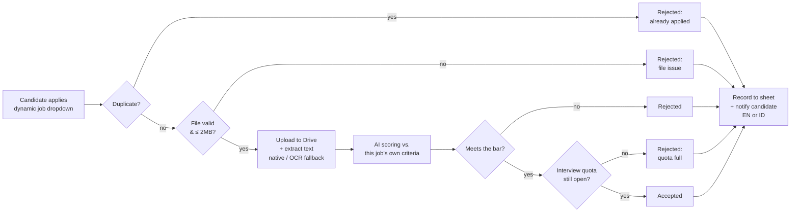

# AI-Powered CV Screening & Recruitment Workflow Automation

An end-to-end recruitment automation pipeline built on **n8n** — from job-specific CV intake to AI-scored shortlisting, interview-quota enforcement, bilingual candidate notifications, and self-healing error handling. No manual sorting, no spreadsheet triage, no human bottleneck between "applied" and "notified."

Built as a single, monolithic, production-shaped n8n workflow — not a chain of fragile sub-workflows — with the same engineering discipline (defect logs, retry policies, rollback records) you'd expect from a client delivery, run as a personal practice engagement end-to-end.

---

## What it does

A candidate applies through a dynamic web form → the system picks the right evaluation bar for the job they applied to → an LLM scores their CV against it → a live interview-quota check decides the real-world outcome → the candidate is notified, in their configured language, automatically.

## Key features

- **Dynamic job intake** — the applicant's dropdown is sourced live from an "open positions" sheet, not hardcoded; closing a job removes it from the form automatically.
- **Per-job AI evaluation criteria** — each posting carries its own minimum score, required skills, and experience bar; the LLM prompt is generated per submission, not a generic one-size rubric.
- **Interview quota enforcement** — a candidate can score above the bar and *still* be correctly marked `rejected_quota_full` (with an honest, quota-specific message) once a job's interview slots are full — the system never tells a qualified candidate an unrelated rejection reason.
- **Duplicate detection & smart pre-validation** — repeat applications and oversized/invalid files are rejected *before* any Drive upload or AI call — zero wasted processing cost on invalid submissions.
- **PDF extraction with OCR fallback** — native text extraction first, automatic OCR hand-off for scanned/image-based resumes.
- **Bilingual output, config-driven** — every system-facing surface (form, notifications, AI reasoning) switches between English and Indonesian from a single spreadsheet cell — no workflow edit required.
- **Self-healing technical error handling** — a dedicated fault-catching workflow (native `Error Trigger` binding, not manual try/catch scattered through the business logic) logs infrastructure faults to their own audit trail and alerts an admin — kept strictly separate from ordinary business rejections, which get their own clean candidate-facing messages instead.
- **Automatic retry** on every external API call (storage, AI, spreadsheet, email) — transient failures (a rate limit, a momentary outage) resolve themselves before ever reaching a human.
- **Fully config-driven operations** — active language and the admin alert recipient are both editable by a non-technical user from a spreadsheet cell; no redeploy needed.
- **Dual intake channels** — a webhook API for platform integration, and a native multi-page form for direct use, both sharing one pipeline and one set of business rules.

## Engineering highlights

A few of the harder problems this build actually had to solve — included because "it works" is less interesting than *how* it stays working:

- **Platform-level trigger incompatibility, isolated and resolved.** n8n's Form Trigger and its `Respond to Webhook` node turned out to be structurally incompatible on this deployment — diagnosed via controlled A/B probes and a live container log capture (not guesswork), then engineered around without dropping the native-form UX.
- **Silent data-loss classes caught by design, not luck.** Google Sheets' filtered reads and multi-field writes were found to drop data silently under specific conditions (e.g. a correct filter still returning fewer matching rows than truly exist). The fix — read unfiltered, filter in code — is now a standing rule, not a one-off patch.
- **Retry and error handling verified, not assumed.** A real internal node failure was deliberately forced (reversibly, in a test environment) to prove retries actually fire and that the fault-handling workflow genuinely cascades — not just validated as "should work" on paper.
- **Config over code, consistently.** Language, evaluation criteria, and alert recipients all live in spreadsheet cells a non-engineer can edit — the workflow itself never needs to change for routine operational adjustments.

## Architecture

- **Automation engine:** [n8n](https://n8n.io/) — one primary pipeline workflow + one dedicated error-handling workflow
- **AI evaluation:** Google Gemini, structured-output scoring per job criteria
- **Storage:** Google Drive (resumes) + Google Sheets (applicant records, job openings, system config, error log)
- **Notifications:** Gmail, bilingual templated messages
- **Intake:** native n8n form (multi-page, dynamic dropdown) + webhook API, same business logic either way

## Project status

This is a **practice engagement** — built and run end-to-end as if delivering to a real client, including the full documentation trail (Blueprint, test evidence, defect log, delivery package) — but the "client" is a self-ratified exercise, not a paying engagement. The pipeline is fully built, live-verified end-to-end (all outcome branches, both languages, forced-failure error handling), and running on a personal TEST n8n instance. It has not been deployed to a production client environment.

Full engineering documentation — architecture, test evidence, defect resolutions, and the deployment binding layer — lives in this repository:

- [`engineering-blueprint.md`](engineering-blueprint.md) — system design and decomposition
- [`deployment/test-runtime-bindings.md`](deployment/test-runtime-bindings.md) — the complete build/test/defect log
- [`implementation/schemas/`](implementation/schemas/) — data schemas
- [`delivery/`](delivery/) — delivery documentation set

---

*Built by [tama28967](https://github.com/tama28967) as an n8n automation portfolio piece.*
